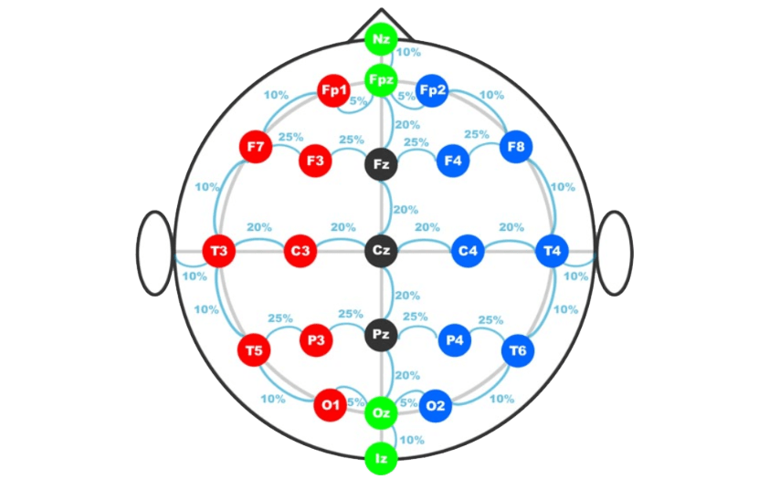
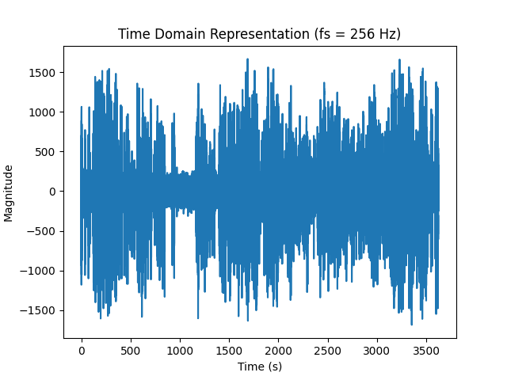
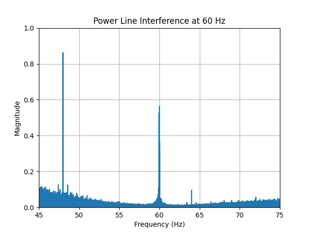
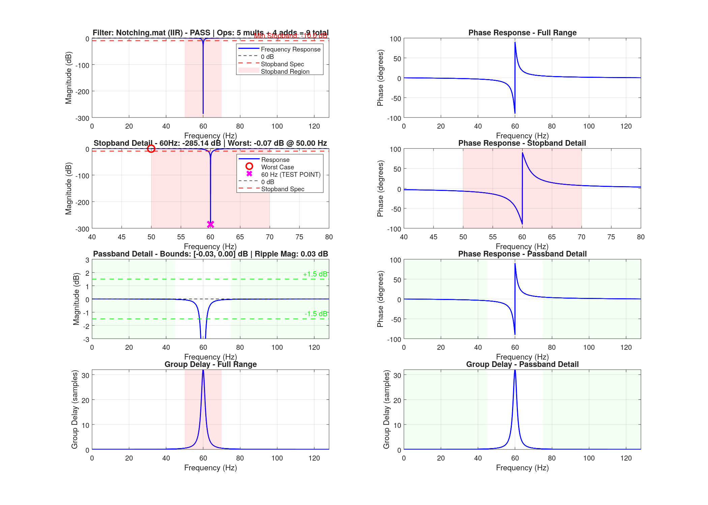
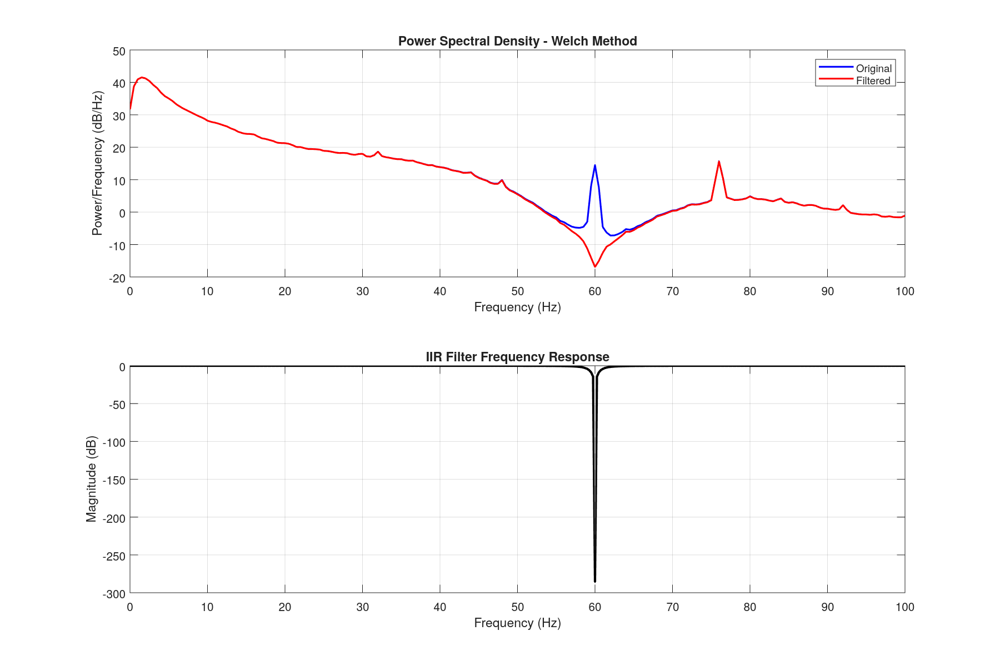
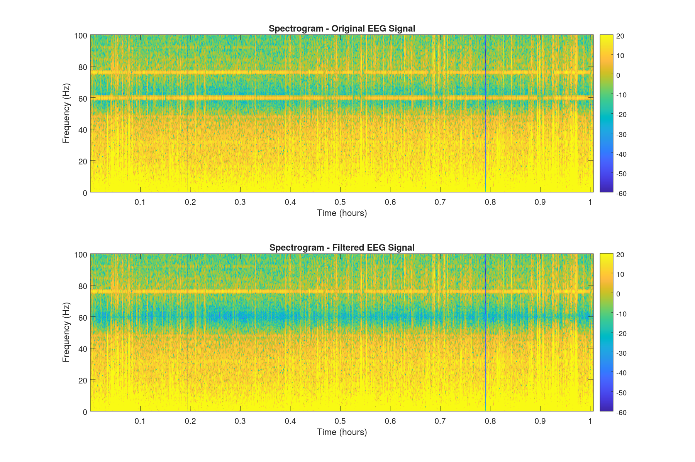
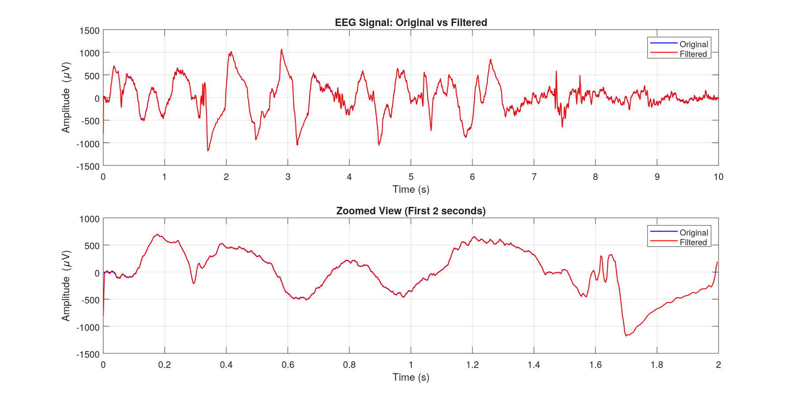

# Digital Filter Design for EEG Brain Signal Enhancement
In this application, we will work on implementing a filter to remove the power-line interference originating from electrical mains. These appear as strong peaks in the frequency spectrum at the harmonics of the narrowband sinusoidal tone of the electrical power sources used for powering the instrument as well as those in the near viscinity. 
These sharp spikes can have a large negative effect on the quality of the signal and makes it more difficult to distinguish the information of interest. 

The data source used was collected in Boston, U.S.A, which has a power line frequency of 60 Hz. 
This means we expect to see sharp spikes at the 60 Hz and its respective harmonic frequencies in the frequency spectrum.

Data-source: [CHB-MIT Scal p EEG Database 1.0.0](https://physionet.org/content/chbmit/1.0.0/chb12/chb12_29.edf) 
## Part 1: Problem Definition and Specifications
We approach this problem through a systematic lens. 
At this level, we are going to oversimplify the requirements and place some arbitrary constraints which only seek to demonstrate the process of thinking. 
### 1.1 Problem Formulation
The signals of a brain ECG are measured using standard electrode placements. In particular, our data-source uses the 10-20 EEG system which is shown below. 
<figure>
    
    <figcaption>Time Domain Representation of the signal measured at F7</figcaption>
</figure>
In general, the electrode placement position matters drastically in terms of the different types of signals measured as well as the levels of the different sources of interference (e.g. electrodes placed closer to the front measure more eye-blink artifacts, A.K.A EOG, than those at the back of the head). 
For our case, however, we are dealing with a position-independent source of interference which affects the whole system indiscriminantly. 
This means that an arbitrary choice of signal from the set will generally produce similar problem statements to the rest given that the region of interest have similar behavior, or in other words highly correlated.
<figure>
    
    <figcaption>Time Domain Representation of the signal measured at F7</figcaption>
</figure>
The time domain representation of a signal of this type generally do not give much in terms of interpretation and tend to require more advanced analysis. Hence, it is of little interest to us.
<figure>
    
    <figcaption>Frequency Domain Representation of the signal measured at F7(rect window)</figcaption>
</figure>
What immediately stands out in the frequency domain are the several sharp spikes at different points. 
What we are interested in, however, are only those at 60 Hz and its harmonics (120 Hz, etc.).  

For the sake of simplicity, we will only be tackling one of the spikes (60 Hz), as the same procedure can be repeated for the latter frequency.
We would like to remove this interference from the signal, and due to it's nature as a spike without an effect on the signal as a whole, we are dealing with a stop-band filter shape. 
Our goal is to attenuate the frequencies which lie within a certain bandwidth in the spectrum. 
Ideally, we would simply create a notch filter which fits the characteristics exactly, but we would like to compare its performance with other approaches to validate our choices.

### 1.2 Constraints Identification
We choose to take a simple approach to filtering, and a reasonable range to work within is an order of complexity of 20 FLOPs would give us a numerically stable set of coefficients given that the filter is stable and we are operating with double accuracy floating points.

Further, so as to give the FIR a fair chance against the IIR filters which tend to have better performance for the same number of FLOPs, we will set a constraint on the latency such that the latency of the execution does not exceed 20 multiplication FLOPs.

For the IIR filter implementations, the filter must be stable to at least a single floating point accuracy rounding.

### 1.3 Filter Specifications
Taking a closer look at the region of interest, 
<figure>
    
    <figcaption>Frequency Domain Representation of the Power Line Interference at 60 Hz</figcaption>
</figure>
Within a 30 Hz band centered about the 60 Hz, there are two other visible spikes: 

- Large spike magnitude of ~0.85 at 48 Hz 
- Small spike of magnitude ~0.1 at 64 Hz. 

Assuming that the small spike is of negligible interest to us, we take our region bandwidth to be 20 Hz from [50,70], where we are free to choose the shape of the transition.
Since the magnitude is not very large, we choose to take a minimum stop band attenuation $\delta_s= 10 \text{dB}$, and to prevent severely impacting the remaining signal, we place a tolerable passband ripple $\delta_p=1.5\text{dB}$. 
And clearly, the cutoff/notch frequency we would like to attenuate is $f_c=60 \text{Hz}$.

In summary, our specs are: 

- Order $\leq$ 20
- Latency $\leq$ 20 multiplication FLOPs
- Stable
- $BW=20$
- $\delta_s= 10 \text{dB}$
- $\delta_p=1.5\text{dB}$
- $f_c=60 \text{Hz}$

## Part 2: Filter Design and Analysis
### 2.1 Multiple Filter Designs
We will be comparing 4 of our python-implemented filters against 9 MATLAB implemented filters made using the filterDesigner methods. 
We create an initial filtering stage to get the filters which meet the minimum specs, and then we will compare their performance individually and eventually make a decision about which filter comes out on top in terms of its overall performance.
| Implementation | Filter type | Method | File name | Meets Specs | Initial Rating|
| ------------ | ------------ | ------------ | ------------ | ------------ | ------------ |
|MATLAB | FIR | Low+High LS | Low+High.mat | No | TBD|
|MATLAB | FIR | All-Band LS | Filter File Name | No | TBD|
|MATLAB | FIR | Bandstop LS | Filter File Name | No | TBD|
|MATLAB | FIR | Bandstop equiripple | Filter File Name | No | TBD|
|MATLAB | FIR | Bandstop Window (type) | FIR Window Kaiser.mat | No | TBD|
|MATLAB | IIR | Direct-Form Notching| Notching.mat | Yes | TBD|
|MATLAB | IIR | Bandstop Butterworth| IIR 4th-order filter.mat | Yes | TBD|
|MATLAB | IIR | Bandstop Chebyshev Type I| IIR 4th-order Chebyshev I.mat | Yes | TBD|
|MATLAB | IIR | Bandstop Chebyshev Type II| 4th-order IIR chebyshev II.mat | Yes | TBD|
|Python (Ours) | FIR | Bandstop LS | python_ls_Filter | No | TBD|
|Python (Ours) | FIR | Bandstop WLS | python_wls_Filter | No | TBD|
|Python (Ours) | IIR | Direct-Form Notching| python_df_Filter | Yes | TBD|
|Python (Ours) | IIR | Manual Pole-Zero Placement| python_pz_Filter | Yes | TBD|

### 2.2 Decision Analysis
| File name | Stop Band Attenuation ($w=0.3$) | Passband Ripple ($w=0.3$)| Complexity ($w=0.1$)|  Coefficients ($w=0.2$)| Phase Linearity ($w=0.1$)| Utility |
| ------------ | ------------ | ------------ | ------------ | ------------ | ------------ | ------------ |
| Notching.mat | 285.18 | 0.03 | 9 | 5 | 0 | 8 |
| IIR 4th-order filter.mat | 88.73 | 0.05 | 17 | 11 | 0.3 | 7 |
| IIR 4th-order Chebyshev I.mat | 69.62 | 1 | 17 | 11 | 0.5 | 6.2 |
| IIR 4th-order Chebyshev II.mat | 11.00 | 0.02 | 17 | 11 | 0 | 6 |
| python_pz_Filter.mat | 300.00 | 0.83 | 9 | 5 | 0 | 7.5 |
| python_df_Filter.mat | 292.04 | 0.68 | 9 | 5 | 0 | 7.5 |
### 2.3 Implementation and Validation
Based on the above metrics, we conclude that the best filter is Direct-Form Notching filter, which gives the following response.
<figure>
    
    <figcaption>Direct-Form Notching Filter with Bandwidth = 10 Hz</figcaption>
</figure>

## Part 3: Performance Evaluation
In this part we view the final results and evalute the performance of the filter when applied to the signal at hand.
### 3.1 Frequency Domain Analysis
As mentioned above, or goal is mainly to remove the 60Hz frequency component from the signal with minimal distrotion to the signal.

<figure>
    
    <figcaption> </figcaption>
</figure>
We clearly see that the 60Hz component has been removed and only affected a very short band around it.

<figure>
    
    <figcaption>  </figcaption>
</figure>

### 3.2 Time Domain and Perceptual Evaluation
<figure>
    
    <figcaption> Time Domain comparison between the original and filtered signal </figcaption>
</figure>

We can notice that there is little, to almost no visible change in the signal in the time domain, even when we zoom in down to 2 seconds.

| Metric | Original Signal | Filtered Signal | Difference |
|--------|----------------|-----------------|------------|
| Mean (µV) | 0.2134 | 0.2134 | -0.0000 |
| Std Dev (µV) | 234.3411 | 234.2809 | -0.0602 |
| RMS (µV) | 234.3411 | 234.2809 | -0.0602 |
| **Error Metrics** | | | |
| Mean Squared Error (µV²) | - | - | 20.0366 |
| Root Mean Squared Error (µV) | - | - | 4.4762 |
| **Frequency Domain** | | | |
| Noise Reduction (50-100 Hz, dB) | - | - | 0.94 |
## Part 4: Filter Designer Usage
Though the results of the python implementations ended up performing worse than the MATLAB implementations, we would consider this expected as the python implementations were made under a tight time frame with high simplicity in mind.
### Least Squares FIR Filter Implementation
We are trying to obtain the filter coefficients of a symmetric filter $h[n]$ for the problem 

$\mathbf{\hat{H}_d}(\omega)=\mathbf{F}(\omega)\mathbf{\hat{h}}[n]$

which is the DTFT of the impulse response, where we are trying to minimize the square error 

$\min (\mathbf{H_d}-\mathbf{\hat{H}_d})^2$

Defining vectors for frequency samples and creating the Fourier matrix corresponding to 

$$\mathbf{\Omega}= 
\begin{bmatrix} 
\omega_0 \\ 
\omega_1 \\ 
\vdots \\
\omega_n
\end{bmatrix}
\begin{bmatrix} 
0 &  
1 & 
\dots & 
n
\end{bmatrix}$$

$$
\mathbf{E_y}=
\begin{bmatrix} 
1 \\
1 \\
\dots \\ 
1
\end{bmatrix}$

to give

$\mathbf{F}=
\begin{bmatrix} 
\mathbf{E_y}|2\cos(\mathbf{\Omega})
\end{bmatrix} 
$

and we solve the least-squares problem exactly using 

$
\mathbf{\hat{h}}=
(\mathbf{F}^T \mathbf{F})^{-1}\mathbf{F}^T \mathbf{H_d}
$

### Weighted Least Squares FIR filter design
We do the same as the ordinary least squares problem but with the addition of a weight function for the error $W$

$\min (W^{1/2}(\mathbf{H_d}-\mathbf{\hat{H}_d}))^2$

$
\mathbf{\hat{h}}=
(\mathbf{F}^T \mathbf{W}\mathbf{F})^{-1}\mathbf{F}^T \mathbf{W}\mathbf{H_d}
$
### Pole-Zero Placement IIR Filter Implementation
We place poles and zeros in the $z$ plane such that

$H(z)=\frac{Y(z)}{X(z)}
=\frac{\sum_{k=0} b(k)z^{-k}}{1-\sum_{k=1} a(k)z^{-k}}
=\frac{\prod_{n=1} (z-\zeta_n)}{\prod_{m=1} (z-p_m)}
$

where $\zeta$ and $p$ are the complex zeros and poles of the system.
### Direct-Form Notch IIR Filter Implementation
Using the same logic as the pz placement, however we make use of the fc and fs parameters such that we place a zero at the fc point and right behind it (within the unit circle) we place a pole. This ensures we have a zero at the point of interest, but as we move away, we find the effect of the pole and zero to cancel out and hence giving us an effectively no gain or attenuation.
